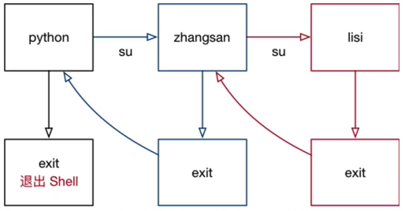
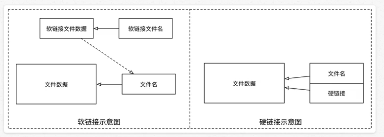

### linux 目录表

/ 根目录

/bin 、 /usr/bin 可执行二进制文件目录，如常用的命令ls cat等

/boot 放置系统启动时用到的一些文件，如内核文件

/dev 存放系统下的设备文件，访问该目录下的文件，相当于访问某个设备，常用的是挂载光驱`mount /dev/cdrom/mnt`

/etc 系统配置文件，重要的配置文件有


### 文件大小表示方式

| 单位 | 英文          |
| ---- | ------------- |
| 字节 | B (Byte)      |
| 千   | K (KibiByte)  |
| 兆   | M (MebiByte)  |
| 千兆 | G (GigaByte)  |
| 太   | T (TeraByte)  |
| 拍   | P (PetaByte)  |
| 艾   | E (ExaByte)   |
| 泽   | Z (ZettaByte) |
| 尧   | Y (YottaByte) |


### linux 常用命令

| 命令          |                      | 作用                                                         |
| ------------- | -------------------- | ------------------------------------------------------------ |
| ls            | list                 | 查看当前文件夹下的内容                                       |
| pwd           | print work directory | 查看当前所在文件夹                                           |
| cd[目录名]    | change directory     | 切换文件夹                                                   |
| touch[文件名] | touch                | 如果文件不存在，新建文件<br />如果文件已经存在，修改文件的末次修改日期 |
| mkdir[目录名] | make directory       | 创建目录                                                     |
| rm[文件名]    | remove               | 删除指定的文件名                                             |
| clear         |                      | 清屏                                                         |


**ls 常用选项**

* `-a` 显示所有目录和文件，包括隐藏文件

  ```shell
  $ ls -a
  . .. .xxx.txt
  # 以.开头的文件/文件夹为隐藏文件/文件夹
  # . 代表当前目录
  # .. 代表上一级目录
  # 蓝色为目录，白色为文件
  ```


* `-l` 以列表方式显示文件的详细信息
* `-h` 配合-l 以人性化的方式显示文件大小

选项可以合写，无顺序

```shell
$ ls -alh
```

ls **通配符**

* `*` 代表任意个数个字符
* `？`代表任意一个字符
* `[]` 表示可以匹配字符组中的任意一个
* `[abc]` 匹配`a`、`b`、`c` 中的任意一个
* `[a-f]` 匹配 `a-f` 任意一个字符


**cd 常用选项**

* `cd `/`cd ~ ` 切换到当前用户的主目录

* `cd ..` 切换到上一级目录

* `cd -`  在最近两次工作目录间切换


**mkdir**

* `-p` 可以递归创建目录

```shell
$ madir -p a/b/c
```

> 同一目录下文件夹名称不能和文件名同名


**rm**

> 删除时直接删除，不放入回收站

* `-f ` 强制删除，忽略不存在的文件，无需提示

* `-r ` 递归的删除目录下的内容，或用于删除文件夹


### 终端命令格式

```bash
$ command [-options][paramete]
```

command : 命令名，相应功能的英文单词或单词缩写
-options： 选项
paramete ：参数


### 查阅帮助信息

```bash
$ command --help
$ man command
# man 是manual缩写,手册
# 使用man 时的操作键
#	空格 显示手册的下一屏
#	enter 一次滚动手册页的一行
#	b 回滚一屏
#	f 前滚一屏
#	q 退出
#	/word 搜索word字符串
```


### 终端技巧

* 自动补全

  在敲出 文件/目录/命令的前几个字母后，按下 `tab` 键

  * 如果输入没有歧义，系统会自动补全
  * 如果输入有歧义，再按一下 `tab` 键，系统会提示可能存在的命令

* 曾经使用过的命令

  按上下键可在曾经使用过的命令间切换，`Ctrl+c ` 退出选择


### 文件和目录常用命令

#### 拷贝和移动文件

* `tree [目录名]`：  以树状图列出文件目录结构

	`-d`  只显示目录，不显示文件

* `cp 源文件 目标文件`： copy 复制文件或者目录

```shell
$ cp  ~/Documemt/readme.txt  ./readme.txt
# 将 ~/Documemt/ 目录下的 readme.txt 文件复制到./目录下并以readme.txt命名
# 如果不修改文件名，只需要写目标路径
$ cp  ~/Documemt/readme.txt  ./
```

	`-i` ：覆盖文件前提示 y 覆盖 n 不覆盖

	`-r` ：若给出的源文件是目录文件，将递归复制该目录下的所有子目录和文件，目标文件必须为一个目录名


* `mv 源文件 目标文件`：move 移动文件或目录/ 文件或目录重命名

```shell
$ mv  ~/Documemt/readme.txt  ./
# 将 ~/Documemt/ 目录下的 readme.txt 文件移动到./目录下
$ mv readme.txt demo.txt
# 将readme.txt文件名修改为demo.txt
```

	`-i` ：覆盖文件前提示 y 覆盖 n 不覆盖


#### 查看文件内容

* `cat` 文件名： `concatenate` 查看文件内容、创建文件、文件合并、追加文件内容等功能，会**一次显示所有内容**，适合内容较少的文本文件

  `-b`：对非空输出行编号

  `-n`：对输出的所有行编号

  > linux 中还有一个 `nl`  命令和 `cat -b` 的效果等价

* `more` 文件名：**分屏显示文件内容** ，按空格显示下一屏，适合查看内容较多的文本

```shell
# 使用 more 时的操作键  和 man 相同
# 空格 显示手册的下一屏
# enter 一次滚动手册页的一行
# b 回滚一屏
# f 前滚一屏
# q 退出
# /word 搜索word字符串
```


* `grep` 搜索文本 文件名： 搜索文本文件内容，输出包含该文本的行

  > linux 中的文本搜索工具，允许对文本文件进行模式查找（正则表达式），如果搜索文本中间有空格可以使用引号包裹

  `-n` 显示匹配行和行号

  `-v` 显示不包含匹配文本的所有行（相当于求反）

  `-i` 忽略大小写

  `^a` 行首，搜索以a开头的行

  `ke$` 行尾，搜索以ke结束的行


#### 其他

* `echo 文字内容` ：会在终端中显示参数指定的文本，通常会和重定向联合使用

* 重定向  `>` 和 `>>`：

> linux 允许将命令执行结果重定向到一个文件，将本应显示在终端上的内容输出/追加到指定文件中，保存命令输出结果

`>` 表示输出，会覆盖文件原有的内容

`>>` 表示追加，会将文件追加到已有文件的末尾

```shell
# 创建 a 文件并将 “hello world”输出到 a 文件中 ，与touch区别
$ echo hello world > a
# 将命令 “ls -lh” 的结果输出到 a 文件中
$ ls -lh > a
```


* 管道 `|`

> linux 允许将一个命令的输出通过管道作为另一个命令的输入，另一个命令对第一个命令的输出进行二次处理
>
> 可以理解为现实生活中的管子，管子的一头塞东西进去，另一头取出来，这里 `|` 的左右分为两端，左端塞东西（写），右端取东西（读）

```shell
# more：分屏显示内容
# 分屏显示命令 “ls -lha” 的输出结果
$ ls -lha ~ | more

# grep：在命令执行结果的基础上查询指定文本
# 查找 “ls -lha ~” 的结果中包含Do的行并显示
$ ls -lha ~ | grep Do
```


### 远程管理命令

#### 关机/重启

`shutdown 选项 时间`

	`-r`  重新启动

> 不指定选项和参数，默认表示一分钟之后关闭电脑
>
> 远程维护服务器时，最好不要关闭系统，而应该重新启动系统

```shell
# 常用命令示例
# 重新启动电脑，now 表示现在
$ shutdown -r now

# 系统在今天20:00 关机
$ shutdown 20:00

# 系统十分钟后自动关机
$ shutdown +10

# 取消关机计划
$ shutdown -c
```


#### 查看或配置网卡信息

`ifconfig`:  `configure a network interface` 查看/配置计算机当前的网卡配置信息

```shell
# 查看网卡配置信息
$ ifconfig

# 查看网卡对应的IP地址
$ ifconfig | grep inet
```

>  在linux中物理网卡通常以 `ensxx` 表示
>
> 127.0.0.1 本地环回/环回地址，一般用来测试本机网卡是否正常


`ping ip地址`： `ping` 检测到目标 ip 地址连接是否正常

 	ping 127.0.0.1 检查本地网卡是否工作正常


#### 远程登录和复制文件

* `ssh 用户名@ip` ：`secure shell` 关机/重新启动

* `scp 用户名@ip:文件名或路径 用户名@ip:文件名或路径`：`secure copy`  远程复制文件

**SSH** ：SSH 客户端是一种使用Secure Shell (SSH) 协议连接到远程计算机的软件协议

* 数据传输是加密的，可以防止远程管理过程中的信息泄露，也能防止DNS欺骗和IP欺骗

* 数据传输是压缩的，可以提高传输速度

>  有关 ssh 配置信息都保存在用户家目录下的 `.ssh`目录下

##### 域名和端口号

`域名`：由一串用点分割的名字组成，例如 `www.baidu.com` ，是IP地址的别名，方便记忆

`端口号`：通过IP地址可以找到网络上的计算机，通过端口号可以找到计算机上运行的程序

> SSH服务器默认端口号为22，Web服务器为80，HTTPS为443，FTP服务器为21，如果没有指定端口号，使用默认端口号


##### SSH 基本使用

```shell
$ ssh [-p port] user@remote
# user 远程服务器上的用户名，如果不指定默认当前用户
# remote 远程机器的地址，可以是IP/域名，或者别名
# port 是SSH server 监听的端口，如果不指定，默认22

# 使用 exit 退出当前用户登录
# ssh 在 linux 或 Unix 系统下可直接使用，win下需要安装软件 putty xshell
```

##### scp 基本使用

```shell
# 从远程服务器拷贝文件
$ scp user@remote ip:文件名或路径 文件名或路径
# -r 复制目录
# -P 指定端口是要用大写的 P

# 上传文件到服务器
$ scp 文件名或路径 user@remote ip:文件名或路径
```

> `scp`  命令只能在 `Linux` 或 `Unix` 下使用

在win系统中需安装filezilla 使用FTP进行文件传输

FileZilla 传输文件时，使用的是 `FTP` 服务而不是 `SSH` 服务，因此端口号应该为 `21`


##### ssh高级

* 免密码登陆

配置公钥：执行 `ssh-keygen` 即可生成 ssh 钥匙，一路回车即可

​	`id_rsa.pub ` 公钥 、 `id_rsa` 私钥

上传公钥到服务器：执行 `ssh-copy-id -p port user@remote`，公钥保存在服务器 `.ssh` 目录下

​	`authorized_keys`

>  本地使用私钥对数据进行加密/解密，服务器使用公钥对数据进行加密/解密
>
> 非对称加密算法
>
> 使用公钥加密的数据，需要使用私钥解密
>
> 使用公私钥加密的数据，需要使用公钥解密

* 配置别名

`~/.ssh/config`

```
Host vultr
	HostName ip地址
	User root
	port 22
```

直接使用 `ssh vultr` 即可实现登陆，`scp` 同样适用


### 用户和权限的相关命令

#### 用户和权限的基本概念

* 用户管理包括 **用户** 和 **组** 管理

* 在linux中可以指定每一个用户针对不同的文件或目录不同的权限

* 对**文件/目录的权限**包括

| 权限 | 英文   | 缩写 | 数字代号 |
| ---- | ------ | ---- | -------- |
| 读   | red    | r    | 4        |
| 写   | write  | w    | 2        |
| 执行 | excute | x    | 1        |
| 无   |        | -    | 0        |

**组**：实际工作中，可以预先对组设置好权限，然后将不同的用户添加到不同的组中（简化了用户权限设置）

```shell
# ls -l 扩展
$ ls -l
-rw-rw-r-- 1 用户名 组名 大小 时间 名称
drwxrwxr-x 2
```

|           |              |                    |              |          |        |      |
| --------- | ------------ | ------------------ | ------------ | -------- | ------ | ---- |
| -         | rw-          | rw-                | r--          | 1        | 用户名 | 组名 |
| d         | rwx          | rwx                | r-x          | 2        |        |      |
| 文件/目录 | 当前用户权限 | 当前组所对应的权限 | 其他用户权限 | 硬链接数 |        |      |

硬链接数：表示有多少种方式可以访问到当前目录/文件，文件的硬链接数通常为1，目录的硬链接数取决于该目录有多少个子目录。


#### 修改文件/目录权限 `chomd`

```shell
$ chmod +/-rwx 文件名|目录
# + 增加权限  - 删除权限
# 直接修改文件/目录的读、写、执行权限，但不能精确到 拥有者/组/其他
$ chmod +x 文件名 // 增加文件可执行权限
$ chmod -r 目录 // 删除目录可读权限
# 目录的可读权限：读取目录内容（如果没有此权限，可cd，不能ls）
# 目录的可写权限：修改目录内容
# 目录的可执行权限：对目录执行终端命令（如果没有此权限，甚至无法 cd 到目录）
```

chmod 高级用法


#### 超级用户

* `root` 账户用于系统的维护和管理，对操作系统的所有资源具有所有访问权限

* 不推荐直接使用 root 账户登录系统

* 在 linux 安装过程中，系统会自动创建一个标准用户账号


**sudo**

* `su` 是 `substitute user` 缩写，表示使用另一个用户身份

* `sudo` 命令用来以其他身份来执行命令，预设身份为 root

* 用户使用 sudo 时，需先输入密码，之后有五分钟的有效期，超过期限去重新输入密码


#### 组管理

`groupadd 组名` ：添加组

`groupdel 组名` ：删除组

`cat /etc/group` ：确认组信息

`chgrp 组名 文件/目录名` ：修改文件/目录的所属组  -R 递归修改

> 创建组/删除组的终端命令都需要通过 sudo 来执行
>
> 组信息保存在 /etc/group 文件中
>
> /etc 目录是专门用来保存 系统配置信息的目录


#### 用户管理

**创建用户/设置密码/删除用户**

`useradd -m -g 组 新建用户名` ：添加新用户

​	-m 自动建立用户家目录

​	-g 指定用户所在的组，否则会建立一个和用户名同名的组

`passwd 用户名`：设置用户密码

​	如果是普通用户，直接用 passwd 可以修改自己的账户密码

`userdel -r 用户名`：删除用户

​	-r 选项自动删除用户家目录

`cat /etc/passwd | grep 用户名`：确认用户信息

​	新建用户后，用户信息保存在 `/etc/passwd` 文件中


> 创建用户/删除用户/修改其他用户密码 的命令都需要通过 `sudo` 执行
>
> 用户信息保存在 `/etc/passwd` 文件中


**查看用户信息**

`id [用户名]`：查看用户UID 和 GID 信息

`who` ：查看当前所有登陆的用户列表

```shell
$ who
用户名  时间 (:0) # :0 表示当前电脑
用户名  时间 (172.16.xx.xx)
```

`whoami` ：查看当前登录用户的账户名


**passwd 文件** 由六个分号组成七个信息

1. 用户名
2. 密码（x，表示加密的密码）
3. UID（用户标识）
4. GID（组标识）
5. 用户全名
6. 家目录
7. 登录使用的shell，就是登陆之后使用的终端，ubuntu 默认使用 `dash`


**usermod**

用来设置用户的主组/附加组 和登录shell

主组：在用户新建时指定，在 `etc/passwd` 的第四列GID对应的组

附加组：在 `etc/group` 中最后一列表示该组的用户列表，用于指定用户的附加权限

> 设置用户的附加组之后，需要重新登录才能生效

```
# 修改用户的主组
$ usermod -g 组 用户名
# 修改用户的附加组
$ usermod -G 组 用户名
# 修改用户登录shell
$ usermod -s /bin/bash
```

> 默认使用 `useradd` 添加的用户是没有权限使用 `sudo` 以 `root` 身份执行命令的，使用以下命令将用户添加到 `sudo` 附加组中

```
usermod -G sudo 用户名
```


**which**

> `/etc/passwd` 是用于保存用户信息的文件
>
> `/usr/bin/passwd` 是用于修改用户密码的程序

```shell
# which 可用于查看执行命令所在的位置
$ which ls
# /bin/ls
$ which useradd
# /usr/sbin/useradd
```

> `cd ` 这个命令是内置在系统内核中的，没有独立文件，因此用 `which` 无法找到

**bin 和 sbin**

`/bin` (binary) 是二进制执行文件目录，主要用于具体应用

`/sbin` (system binary) 是系统管理员专用的二进制文件目录，主要用于系统管理

`/usr/bin` (user commands for applications) 后期安装的一些软件

`/usr/sbin` (super user commands for applications) 超级用户的一些管理程序

>  bin 存储普通可执行文件，sbin存储跟系统管理相关的可执行文件


#### 切换用户

`su - 用户名`：切换用户，并且切换目录

​	`-`  可以切换到用户家目录，否则保持位置不变

`exit`： 退出当前登录用户

> `su` 不接用户名，可以切换到 `roo `，不推荐，不安全

exit示意图：




#### 修改文件权限


chowm 修改拥有者

chgrp 修改组

chmod 修改权限

```shell
# 修改文件/目录的拥有者
$ chown 用户名 文件名/目录名
# 递归修改文件/目录的组
$ chgrp -R 组名 文件名/目录名
# 递归修改文件权限
# 755 三个数字分别代表 用户 u /组 g /其他用户 o 的权限
$ chmod -R 755 文件名/目录名
```

> r --> 4   w --> 2    x --> 1  无权限 --> 0 ，想要什么权限直接将数字相加


### 系统信息相关命令

>  查询服务器上当前系统日期和时间 / 磁盘空间占用情况 / 程序执行情况

#### 时间和日期

`date` ：查看系统时间

`cal` ：`calendar` 查看日历， `-y` 选项可以查看一年的日历

#### 磁盘和空间目录

`df -h` ：`disk free` 显示磁盘剩余空间  -h 以人性化的方式显示文件大小

`du -h [目录名]` ：`disk usage` 显示目录占用空间情况，不指定目录默认表示当前目录

> -h 以人性化的方式显示文件大小

#### 进程信息

PID 进程代号

`ps au` : `process status` 查看进程的详细状况，默认只显示当前用户通过终端启动的程序

​	ps 选项(没有减号)

​	`a` 显示终端上的所有进程，包括其他用户的进程

​	`u` 显示进程的详细状态

​	`x` 显示不是通过终端启动的进程

`top` : 动态显示运行中的进程并且排序 ，输入 q 退出

`kill [-9] 进程代号` : 终止指定代号的进程，`-9` 表示强行终止


### 其他命令

#### 查找文件

`find [路径] -name “*.txt”`  : 查找指定路径下扩展名为.txt 的文件，包括子目录

​	如果省略路径，表示在当前文件夹下查找

#### 软连接

`ln -s 被链接的源文件 链接文件` ：建立文件的软链接，类似于 Windows 下的快捷方式

注意：

* 如果没有 `-s` 选项建立的是一个硬链接文件（两个文件占用相同大小的磁盘空间，几乎不用）

* 源文件要使用绝对路径，可以方便移动链接文件后，仍然能够正常使用


##### 文件软硬链接示意图



* 在 linux 中**文件名**和**文件的数据**是分开存储的

* 在 linux 中，只有文件的硬链接数为 0 文件才会被删除

* 在日常工作中几乎不会建立文件的硬链接

#### 打包和解包

tar 是Linux中常用的备份工具，此命令可以把一系列文件打包到一个大文件中，也可以把一个打包的大文件恢复成一系列文件

```shell
# 打包文件
tar -cvf 打包文件.tar 被打包的文件/路径 (多个文件一次写在后面，用空格隔开)
# 解包文件
tar -xvf 打包文件.tar
```

* `c` 生成档案文件，创建打包文件

* `x` 解开档案文件

* `v` 列出归档接档的详细过程

* `f` 指定档案文件名称， f选项必须放在最后

#### 压缩和解压缩

**gzip**

* `tar` 和 `gzip` 命令结合使用实现文件打包和压缩

  * `tar` 只负责打包，但不压缩

  * 用 `gzip` 压缩 `ta`r 打包后的文件，扩展名为 `xxx.tar.gz`

* `tar` 命令中 `-z` 选项可以调用 `gzip`

```shell
# 压缩文件
tar -zcvf 打包文件.tar.gz 被压缩文件/路径
# 解压缩文件
tar -zxvf 打包文件.tar.gz
# 解压缩到指定路径
# -C 解压到指定路径，（路径必须存在）
tar -zxvf 打包文件.tar.gz -C 目标路径
```

**bzip2**

- `tar` 和 `bzip2` 命令结合使用实现文件打包和压缩（用法同 `gzip`）

  - `tar` 只负责打包，但不压缩

  - 用 `bzip2` 压缩 `ta`r 打包后的文件，扩展名为 `xxx.tar.bz2`

- `tar` 命令中 `-j` 选项可以调用 `bzip2`

```shell
# 压缩文件
tar -jcvf 打包文件.tar.bz2 被压缩文件/路径
# 解压缩文件
tar -jxvf 打包文件.tar.bz2
# 解压缩到指定路径
# -C 解压到指定路径，（路径必须存在）
tar -jxvf 打包文件.tar.bz2 -C 目标路径
```


#### 软件安装

`apt` : `Advanced Packaging Tool` ，linux下安装包管理工具，可以方便的安装/卸载/更新软件包

```
# 安装软件
sudo apt install 软件包
# 卸载软件
sudo apt remove 如软件名
# 更新已安装的包
sudo apt upgrade
```


neofetch

screenfetch
